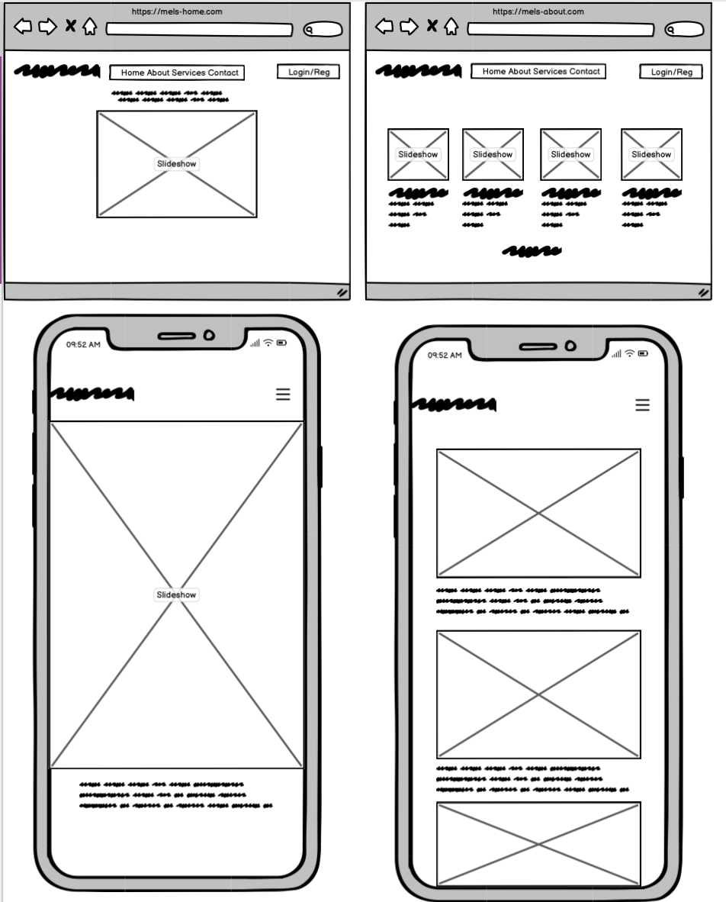
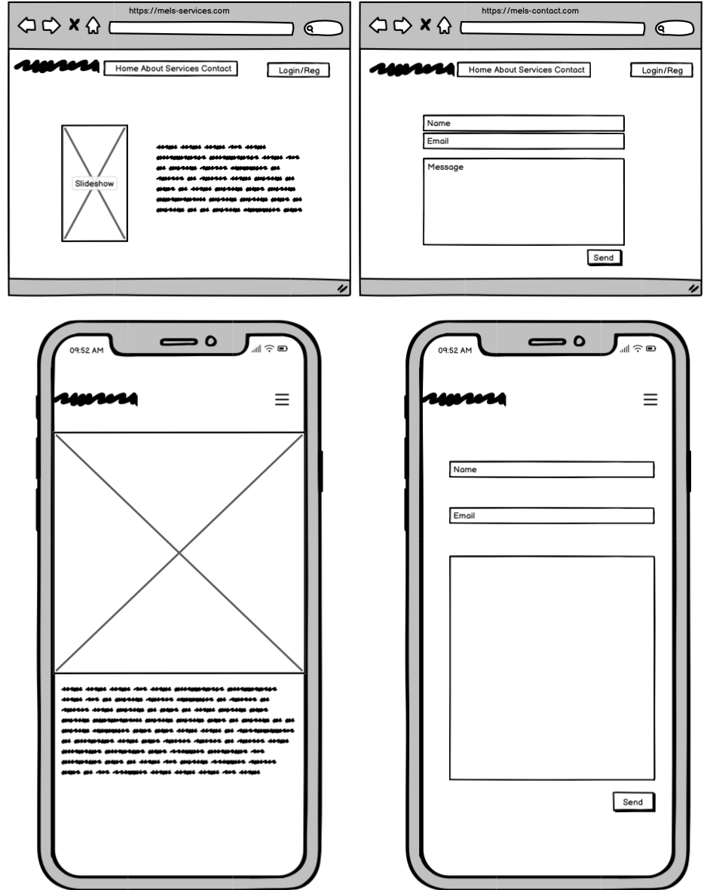
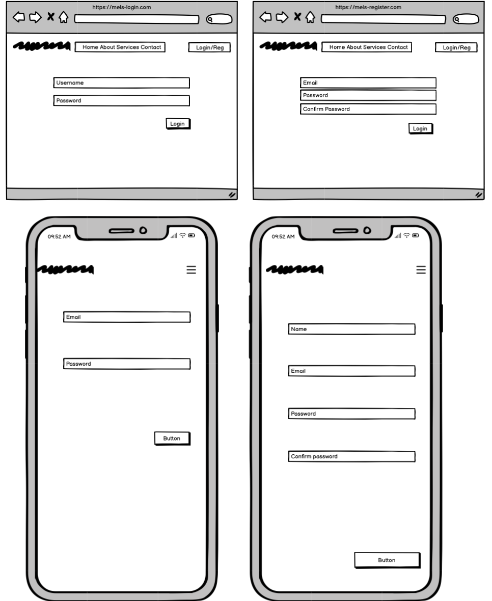
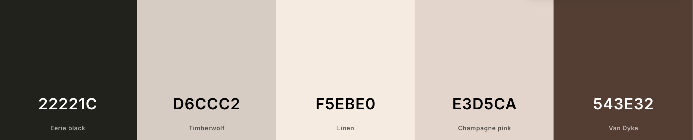

# Touchedbymel

[Live application can be found here](https://mels-18c9cbd51cf1.herokuapp.com/)

This is a full-stack framework project built using Django, Python, HTML, and CSS. This is a makeup booking website designed to display services to customers & allow them to make/edit/delete reservations. This project has been built for educational purposes.

---
## UX

## Strategy
Using the core UX principles I first started with Strategy, thinking about the target audience for this restaurant & the features they would benefit from.

The target audience for 'touchedbymel' are:
- 16-50 year olds
- People who enjoy makeup and trends
- People that enjoy taking care of their appearance

These users will be looking for:
- An informative website, with information that is easy-to-find & concise
- Current & up-to-date makeup services, with essential information such as price and time
- A booking form to make reservation enquiries with the makeup artist
- A way to contact the artist with enquiries
- The ability to make a user account to manage their reservations

This website will offer all of these things whilst also allowing for intuitive navigation and comfortability of use. 

## User Stories
Please find all my defined user stories & their acceptance criteria [here](https://github.com/users/Dilsv/projects/9/views/1)

1.  As a User I can navigate across the site so that I can move around each of the features easily (Must have)
2.  As a User I can use navbar and footer for social links across the site so that I can navigate the site, access services and view social links (Must have)
3.  As a User I can create a contact us page across the site so that I can see users who would like to be contacted (Should have)
4.  As a site user I can view the operating hours and contact the business across the site so that I can see when the opening hours are and can contact them via email, phone and social links (Must have)
5.  As a site user I can create a booking for s specific day and time across the site so that reserve my time slot (Must have)
6.  As a site user I can update my booking so that I am can choose another day or time (Must have)
7.  As a site user I can go to Bookings on the navbar so that I can delete any booking (Must have)
8.  As a site user I can view the details of my booking so that I can be sure of the date and time (Must have)
14. As a Admin/Authorised user I can log in the site so that I can access the backend of the site (Must have)
15. As a Authorised User/Admin I can add bookings manually so that I can enter bookings made via phone or email (Could have)
16. As a Authorised User/Admin I can see the bookings made on the admin site so that I can accept or reject bookings to avoid overlap of bookings or long hours being booked (Could have)
17. As an Admin user I can add or remove services by logging into the site so that I can add more services or remove them (Should have)
18. As an Admin I can create, read, update and delete services from the directory so that I can change the services by adding, removing, viewing or editing them (Should have)
19. As a Site user I am notified so that I get confirmation that I have added, deleted, edited or viewed successfully (Should have)
22. As a Site user I can sign up or register so that I can make a booking if I wish to (Must have)
23. As a Site user I can register to sign up to an account so that my details preinstall when booking a service (Must have)
25. As a Site user I can login so that I can book a service (Must have)
26. As a Site user I can see my login status so that I can know when I am logged in and logged off (Must have)
27. As an Admin/registered user I can search though services and bookings so that I can locate the information I am looking for (Should have)
28. As an Admin/registered user I can search though services and bookings so that I can locate the information I am looking for (Should have)
29. As an Admin/registered user I can filter through bookings and services so that I can see what bookings I have made on specific dates (Should have)
30. As a Site user I can visit the site's blog to find out more information about the site so that I can read/get more information (Must have)
31. As a Site owner I can give users a fully responsive site so that Users/potential are provided with good user experience (Must have)
32. As a Site owner I can affirm data entered into my website so that I ensure all data entered is correct (Should have)
33. As a Site user I can view the options of services so that I can choose which I would like to book for (Must have)
34. As a Site user I can use the about page so that I can get more information on the business (Must have)
35. As a Site user I can not book a past date so that I can make a valid booking (Must have)
36. As a Site user I can view blog posts individually so that I can avoid overcrowding (Should have)
37. Automated testing
38. Manual testing
40. Validate and clean code

## Scope
In order to achieve the desired user & business goals, the following features will be included in this release:

- Responsive navbar that will navigate to the various pages throughout the site
- Landing page with a slideshow of photos of some of the work of the artist with brief information
- About page, with brief introduction to who the respective artist is
- Services page, with a booking form to enquire with the artist
- Manage reservations page, where logged-in users can edit/delete existing reservations they have.
- Update details page, for logged in users to update their details which in turn updates the customer model. 
- Register/login feature using Django allauth
- Contact form that sends an email using Gmail SMTP

## Structure
This website is designed for simplicity, with each page containing only essential information to help users quickly find what they need without sifting through unnecessary content. Key features are separated to clearly highlight their functionality for the user.

The website is made of four apps:

1. Home - home display and fucntionality
2. About - about display
3. Services - contact display and functionality
4. Contact - reservations enquiries & customer management
5. Register - registration for account management
6. Login - Existing clients can login and manage upcoming appointments

### Databases

#### Services 
This is made up of 3 models - Customer, Service and Reservation. The Customer model has customer id as a primary key along with name, email and phone number fields. The Service model has the table id as a primary key along with service name. The Reservation model has reservation id as a primary key and holds the customer, requested date, and the status of the booking. The reservation model also has customer and table as foreign keys.

The services are made up for four models - Natural item, Glam item, Bridal item and HD item. Each item has an id as a primary key and name, description and price.

### Skeleton
Home & Services Page:

About & Contact Page:

Register/Login Page:

Please note the actual website differs slightly from the original wireframes. 

The theme of simplicity follows through to the design, I've used bootstrap columns and rows to divide the pages and tried to keep the same layout throughout so that the user has a sense of ease when on the various pages.

### Surface
Initially, the colour palette I chose for this website was Nudes, Browns and Black. I felt that these colours complimented eachother well and were consistant with the theme of the website. When designing the website I felt that some of these colours were a good match to the theme so I stayed consistent throughout the website.

I chose the fonts 'Whisper' & 'Roboto', I wanted a sleek font to use for headings which is why I chose 'Whisper' and then 'Roboto' for the general content as it's easier to read for the user. 

---
## Features

### Home page
**Navigation bar**: The navigation bar has links to all the active pages for the user and are clearly labelled. The navigation bar has an 'active' style, when a nav link is hovered on it or clicked on, it clearly indicates to the user what they are about to click on or what page they are currently on. 

If the user is logged in then the navigation bar shows 'logout' for pages that only authorised/registered users can visit & use, they are: 'Manage Reservations', 'Update Details' & 'Logout'. Otherwise, the user will be given the option to 'Register' or 'Login'. This change in the navbar ensures users are directed to pages they can use, preventing any frustration and also prompting the user to sign up for an account. Furthermore, it makes it abundantly clear what the logged-in status is to the user.

The navigation bar is fully responsive and collapses on mobile screens to a sandwich icon, this easily allows the user to continue to use the navigation links without the need to press back on the browser. 

 -------------------------------------------

**About images with links**:

 -------------------------------------------

**Footer**: The footer displays links to social accounts. 

 -------------------------------------------

### Services
**Services page**: This page displays the services that the makeup artist offers, it has a card to each service: Natural, Glam, HD and Bridal

 -------------------------------------------

I have chosen to display the services on th same page as the booking form so that the user is able to sign up/sign in and book the service they want as easily as possible, this combination prevents information overload as the pages aren't full of multiple services.

 -------------------------------------------

### Bookings
**Booking form**: This form consists of the customer & reservation model forms, they are displayed together to appear as one to make it simple for the user.

If the user is logged in and they exist in the customer model then their name & email address are pre-populated, this has been done in an effort to improve their overall experience.

 -------------------------------------------

If they are not yet in the customer model then only their email address is added using the email from their user account.

If the user is not logged in at all then the form appears blank, as the form requires the phone number to be entered in no specific format I have added this placeholder to the phone number input field to try and help the user.

 -------------------------------------------

**Manage Reservations**: Logged in users are able to view the 'manage bookings' page, on this page they are shown any booking enquiries they have previously made using the email address associated with their user account. -------------------------------------------

The reservation ID is displayed at the top of the reservation item so they can be easily identified.

There are also edit & delete buttons, users are able to edit or delete existing reservations they have that are either 'confirmed' or 'pending'. 

 -------------------------------------------

I decided that bookings with a date in the past would display with a status of 'expired' and would not be able to be edited or deleted as this could cause confusion for the user and also the admin user, therefore the edit & delete buttons do not display under these reservations. Reservations with a 'rejected' status can also not be changed for the same reasons. -------------------------------------------

The status of 'expired' doesn't get pushed to the model and is used only when displaying the bookings to the user. -------------------------------------------

 -------------------------------------------

 -------------------------------------------

**Edit Reservation**: This page simply displays the reservation form pre-populated using the reservation instance, the user is able to change the date, time or number of guests and resubmit the form. After resubmitting the user is redirected back to the 'Manage Reservations' page and a success message is displayed showing which reservation was edited. 

**Delete Reservations**: This page simply displays the booking selected with all of its information, the user presses 'Cancel Reservation' and a modal pop's up for the user to confirm the cancellation, explaining that this cannot be undone. If the user chooses 'Cancel it' the reservation will be deleted from the model. After confirming the user is redirected back to the 'Manage Reservations' page and a success message is displayed showing which reservation was edited. 

 ---------------------------------------------

 ---------------------------------------------

**Update customer details**: A logged-in user can also update their phone number or full name that is stored in the customer model, this can be done from the 'Update Details' link in the navbar. This page simply displays the customer form but in future I would have liked to have added a feature that enables the user from editing the email field as this can cause problems with the customer model. 

 ---------------------------------------------

### Contact Form
**Contact form**: All users are able to submit a contact form from the 'Contact Us' page, this sends an email to the website owner using Google SMTP. Having a way to communicate with the website owner/restaurant manager is a helpful tool for the user and creates a platform for communication to strengthen the relationships with customers.

 ---------------------------------------------

---
## Technologies Used

I have used several technologies that have enabled this design to work:

- [Django](https://www.djangoproject.com/)
    - Django is the framework that has been used to build the over project and its apps.
- [Python](https://www.python.org/)
    - Python is the core programming language used to write all of the code in this application to make it fully functional.
- [Bootstrap](https://getbootstrap.com/)
    - Used for creating responsive design.
- [Google Fonts](https://fonts.google.com/)
    - Used to obtain the fonts linked in the header, fonts used were Raleway and Lobster
- [Font Awesome](https://fontawesome.com/)
    - Used to obtain the icons used on the high scores and rules pages.
- [Google Developer Tools](https://developers.google.com/web/tools/chrome-devtools)
    - Used as a primary method of fixing spacing issues, finding bugs, and testing responsiveness across the project.
- [GitHub](https://github.com/)
    - Used to store code for the project after being pushed.
- [Git](https://git-scm.com/)
    - Used for version control by utilising the Gitpod terminal to commit to Git and Push to GitHub.
- [Gitpod](https://www.gitpod.io/)
    - Used as the development environment.
- [Heroku](https://dashboard.heroku.com/apps)
    - Used to deploy my application.
- [Grammarly](https://www.grammarly.com/)
    - Used to fix the thousands of grammar errors across the project.
- [Pep8](http://pep8online.com/)
    - Used to test my code for any issues or errors.
- [Grammarly](https://www.grammarly.com/)
    - Used to fix the grammar errors across the project.
- [Coloors](https://coolors.co/)
    - Used to create a colour palette for the design.
- [Cloudinary](https://cloudinary.com/)
    - Used to store all of my static files and images.
- [Favicon.io](https://favicon.io/)
    - Used to create favicon's for my website
- [W3C Markup Validation Service](https://validator.w3.org/) 
    - Used to validate all HTML code written and used in this webpage.
- [W3C CSS Validation Service](https://jigsaw.w3.org/css-validator/#validate_by_input)
    - Used to validate all CSS code written and used in this webpage.
- [AmIResponsive](http://ami.responsivedesign.is/)
    - Used to generate responsive image used in README file.
- [Wave](https://wave.webaim.org/)
    - Used to test the accessibility of the website.
- [SQLite](https://www.sqlite.org/index.html)
    - I have SQLite to run my database tests locally.
- [PostgreSQL](https://www.postgresql.org/)
    - I have used Heroku's PostgreSQL relational database in deployment to store the data for my models.
---
## Testing
I have chosen to manually test my website.

### Code Validation

- [W3C Markup Validation Service](https://validator.w3.org/) 
    - Could not but intend to validate all HTML code written and used in this webpage.
    - 

 ---------------------------------------------

- [W3C CSS Validation Service](https://jigsaw.w3.org/css-validator/#validate_by_input)
    - Could not but intend to validate all CSS code written and used in this webpage.

 ---------------------------------------------

- [Pep8](http://pep8online.com/)
    - Could not utilise but intend to test my code for any issues or errors.

### Manual Testing

### Bugs, Fixes and Improvements

#### Bugs

[Slideshow] - The slideshow on Home Page does not flick through the images correctly when website is running.
         This is an ongoing issue.
[Forms] - The bug with the form page could not be resolved. If given the opportunity I will go back and debug the issue ensuring a better user experience. This is an ongoing issue.
[HTML/CSS] - When deployed the HTML and CSS on the site failed to upload due to bugs. If given the opportunity, I intend on going back and ensuring the project runs fluently with all of its features functional. This is an ongoing issue.
[Django Admin] - The backend admin site did not register or show the bookings that were made unless they were manually input. If given the opportunity, I intend on tracing the location of the stored. This is an ongoing issue.
[Debugging] - When the developer sets the DEBUG value to true the website shows the images, HTML and CSS, however when set to False the website crashes. This is an ongoing issue.

#### Improvements

There are aspects of UX and functionality that I would like to improve. 

- First being the data field on the bookings form. It doesn't allow users to choose how many guests will be joining (for group bookings). This could be confusing and not be a very good user experience.
- Secondly I would have liked to use my colour pallet differently. For example, giving each of the service cards a different hue for them to stand out.
- Thirdly I would have liked for users to be able to click onto the specific service and book directly through the service card which would prohibit the user from having to manually choose.
- Fourth I would have liked to have provided some sort of functionality that prevents users from creating a booking that is in the past.
- Fifth, I would have liked to make sure the slideshow was in correct working order to provide the user wit ha better experience.
- Sixth if given the chance, I would complete my homepage blog section to provide the user with an experience with the website theyre using.

---
## Deployment

The master branch of this repository has been used for the deployed version of this application.

### Using Github & Gitpod

To deploy my Django application correctly, I had the intention to use the [Code Institute Python Essentials Template](https://github.com/Code-Institute-Org/python-essentials-template).

- Click the `Use This Template` button.
- Add a repository name and brief description.
- Click the `Create Repository from Template` to create your repository.
- To create a Gitpod workspace you then need to click `Gitpod`, this can take a few minutes.
- When you want to work on the project it is best to open the workspace from Gitpod (rather than Github) as this will open your previous workspace rather than creating a new one. You should pin the workspace so that it isn't deleted.
-  Committing your work should be done often and should have clear/explanatory messages, use the following commands to make your commits:
    - `git add .`: adds all modified files to a staging area
    - `git commit -m "A message explaining your commit"`: commits all changes to a local repository.
    - `git push`: pushes all your committed changes to your Github repository.

*Forking the GitHub Repository*

If you want to make changes to your repository without affecting it, you can make a copy of it by 'Forking' it. This ensures your original repository remains unchanged.

1. Find the relevant GitHub repository
2. In the top right corner of the page, click the Fork button (under your account)
3. Your repository has now been 'Forked' and you have a copy to work on

*Cloning the GitHub Repository*

Cloning your repository will allow you to download a local version of the repository to be worked on. Cloning can also be a great way to backup your work.

1. Find the relevant GitHub repository
2. Press the arrow on the Code button
3. Copy the link that is shown in the drop-down
4. Now open Gitpod & select the directory location where you would like the clone created
5. In the terminal type 'git clone' & then paste the link you copied in GitHub
6. Press enter and your local clone will be created.

### Creating an Application with Heroku

I followed the below steps using the Code Institute tutorial and [Django Blog cheatsheat](https://codeinstitute.s3.amazonaws.com/fst/Django%20Blog%20Cheat%20Sheet%20v1.pdf)

- The following command in the Gitpod CLI will create the relevant files needed for Heroku to install your project dependencies `pip3 freeze --local > requirements.txt`. Please note this file should be added to a .gitignore file to prevent the file from being committed. A `Procfile` is also required that specifies the commands that are executed by the app on startup. 

1. Go to [Heroku.com](https://dashboard.heroku.com/apps) and log in; if you do not already have an account then you will need to create one.
2. Click the `New` dropdown and select `Create New App`.
3. Enter a name for your new project, all Heroku apps need to have a unique name, you will be prompted if you need to change it.
4. Select the region you are working in.

*Heroku Settings*
You will need to set your Environment Variables - this is a key step to ensuring your application is deployed properly.
- In the Settings tab, click on `Reveal Config Vars` and set the following variables:
    - SECRET_KEY - to be set to your chosen key
    - CLOUDINARY_URL - to be set to your Cloudinary API environment variable
- In the resources tab you must install 'Heroku Postgres'

*Heroku Deployment*
In the Deploy tab:
1. Connect your Heroku account to your Github Repository following these steps:
    1. Click on the `Deploy` tab and choose `Github-Connect to Github`.
    2. Enter the GitHub repository name and click on `Search`.
    3. Choose the correct repository for your application and click on `Connect`.
2. You can then choose to deploy the project manually or automatically, automatic deployment will generate a new application every time you push a change to Github, whereas manual deployment requires you to push the `Deploy Branch` button whenever you want a change made.
3. Once you have chosen your deployment method and have clicked `Deploy Branch` your application will be built and you should see the below `View` button, click this to open your application:

 ------------------------------------------------

---
## Credits

Throughout the process of building this website, I have used various sources online to help me fix bugs & tackle problems, in addition to various modules to build the functionality of this website:

[Full-width pic header](https://startbootstrap.com/template/) ------------------------------------------------

[Footer](https://getbootstrap.com/docs/5.1/examples/) ------------------------------------------------

[Navbar](https://getbootstrap.com/docs/5.0/components/navbar/) ------------------------------------------------

[Contact Form](https://ordinarycoders.com/blog/article/build-a-django-contact-form-with-email-backend) ------------------------------------------------

[Django phone number](https://github.com/stefanfoulis/django-phonenumber-field) ------------------------------------------------

[Crispy Forms](https://django-crispy-forms.readthedocs.io/en/latest/) ------------------------------------------------

[Django Allauth](https://django-allauth.readthedocs.io/en/latest/installation.html) ------------------------------------------------

[Gmail SMTP](https://medium.com/@_christopher/how-to-send-emails-with-python-django-through-google-smtp-server-for-free-22ea6ea0fb8e) ------------------------------------------------

[Updating form](https://stackoverflow.com/questions/42217334/django-get-data-and-edit-in-the-same-form-edit-in-one-place) ------------------------------------------------

I have used Aaron Beale's The Diplomat resturant project as a general guidance throughout (https://github.com/ArronBeale/CI_PP4_the_diplomat)

---
## Acknowledgements

I would like to thank my course mentor Mo Shami for his support and guidance throughout the course of the project and my peers Emma Charles-Wilson and Vasileios Tsimourdagkas for their support & feedback.
---